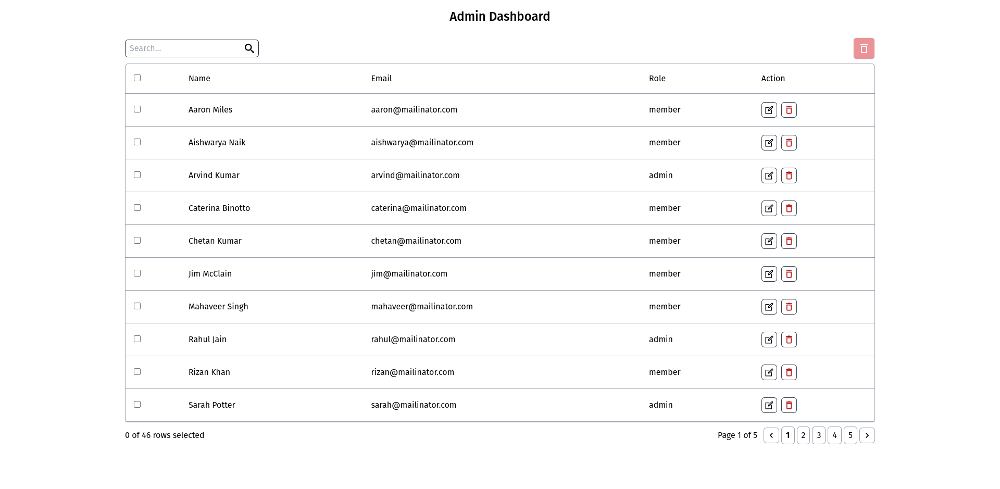

# Frontend Assignment

## Live Link 🚀

[https://frontend-assignment-nine-omega.vercel.app/](https://frontend-assignment-nine-omega.vercel.app/)

## About

- It is a Admin Dashboard which i build for the frontend internship as assesment

## Features

- data fetch from the api and render on the page as table
- Search functionality for search user by name or email
- Implement pagination
- Delete and edit row data
- all select or individual select for delete feature implemented
